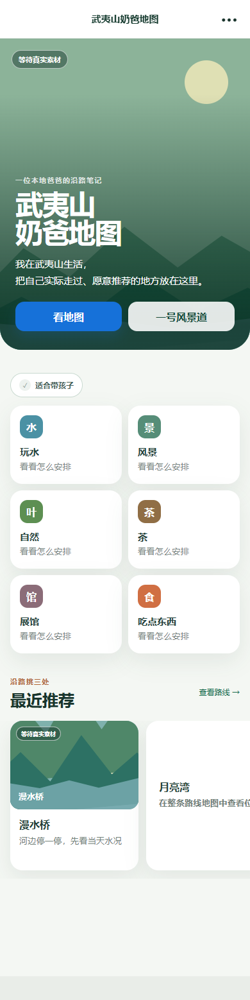
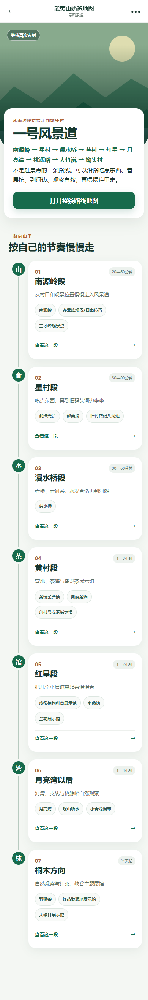
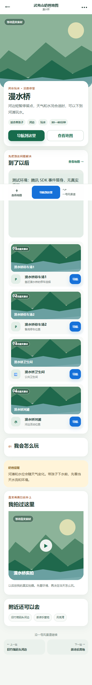
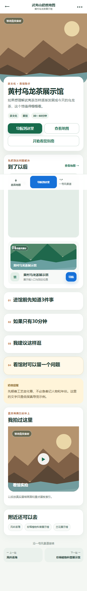
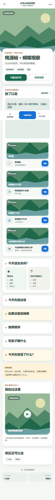
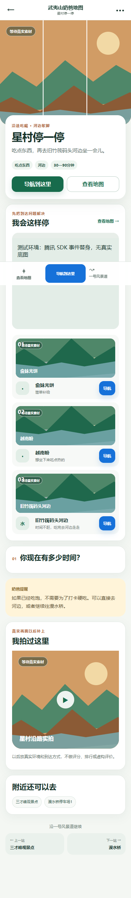
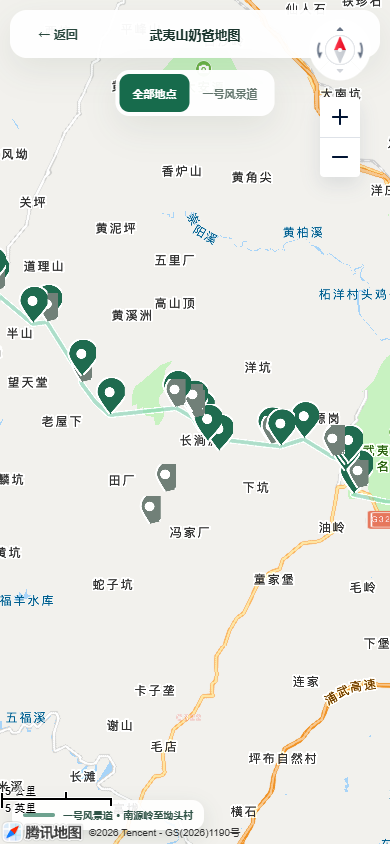

# 第三阶段游客端低保真原型 V0.1 验收报告

生成日期：2026-09-10  
性质：信息架构与手机操作体验原型  
运行边界：本机 / 家庭可信局域网  
状态：等待用户实际体验；不代表正式第三阶段已经批准或完成

## 1. 实现范围

本轮仅新增独立游客端原型，没有开发正式游客产品。原型包含六个可点击页面：

1. `/` 游客首页；
2. `/corridor` 一号风景道；
3. `/place/manshui` 漫水桥户外体验页；
4. `/place/tea` 黄村乌龙茶展示馆看馆页；
5. `/place/butterfly` 桃源峪与龙渡蝴蝶科普展示馆组合页；
6. `/place/xingcun` 星村停留组合页。

四个内容页共用一个页面框架，通过可选内容模块表达户外、展馆、自然观察和吃喝停留。其他真实地点只在路线、地图、附近地点或上下站关系中出现，没有批量生成详情页。

没有实现登录、收藏、评论、评分、搜索、推荐算法、用户上传、小程序、天气、实时交通、支付、SEO、分析系统或公网部署。

## 2. 隔离结构

- `prototype/`：独立 Vue 3 + TypeScript 游客原型。
- `prototype/src/content.ts`：游客内容配置层，仅保存页面讲法、标签、模块和稳定地点编号引用。
- `prototype-server/`：只读本地预览适配器。
- `tests/prototype-browser.ts`：六页面、移动端、数据和导航交互测试。
- `tests/prototype-real-map.ts`：真实腾讯 JavaScript API GL 加载测试。
- `scripts/start-prototype.ps1` / `stop-prototype.ps1`：独立启停。

适配器只提供：

- `GET /api/local-prototype/places`
- `GET /api/local-prototype/map-config`
- `GET /health`

响应明确标记 `local-prototype` / `local-internal-preview`，API 只监听 `127.0.0.1`，由 5174 端口的局域网页面代理访问。没有提供 POST、PUT、PATCH 或 DELETE，也没有建立 `/api/public` 或其他公共坐标接口。

## 3. 页面跳转关系

```text
游客首页
├─ 看地图 → 全屏游客地图 → 地点卡片 → 选择导航落点
├─ 一号风景道 → 路线分段 → 示例详情页或地点卡片
├─ 玩水 → 漫水桥
├─ 带孩子 / 自然观察 → 桃源峪 · 蝴蝶观察
├─ 茶与展馆 → 黄村乌龙茶展示馆
└─ 吃点东西 → 星村停一停

四个详情页
├─ 局部地图
├─ 具体到达点导航
├─ 类型专属内容模块
├─ 附近地点
├─ 上一站 / 下一核心地点
└─ 固定底栏：地图 / 导航 / 一号风景道
```

## 4. 地图交互

继续使用已有腾讯 JavaScript API GL Key。游客原型支持全屏地图、局部地图、地点点击卡片、当前页面地点突出以及服务点弱化。真实底图测试加载 1 个地图画布，取得 13 次成功的腾讯地图服务响应，浏览器运行错误为 0。

路线页按数据库 `corridor_order` 分段读取核心地点；停车、卫生间、入口等服务点保留在地图和详情到达模块中，不在路线总览中与核心地点同级抢占视觉。

## 5. 导航交互

导航先显示“你要去哪里”，由用户选择具体落点，再生成腾讯地图 URI 路线规划地址。自动化测试验证了目标名称、正式经纬度、驾车策略和调用方参数；手机浏览器使用当前页跳转，避免异步打开新窗口被拦截。

本轮没有把外部腾讯地图 App 的拉起结果冒充为已验收。外部 App / 浏览器之间的实际接管行为仍需用户在自己的电脑和手机上体验确认。

## 6. 使用的真实数据范围

当前数据库共有 61 条地点档案。原型只读查询实际返回 41 条“未软删除、非重复档案、具有 active 正式坐标”的当前保留地点，并逐一从现有正式坐标视图读取经纬度。

重点核对：

- 星村：俞妹光饼、越南粉、旧竹筏码头河边，3 条坐标逐值一致；
- 桃源峪组合：桃源峪、桃源峪停车位置、桃源峪卫生间、龙渡蝴蝶科普展示馆，4 条坐标逐值一致；
- 漫水桥组合：漫水桥停车场1、漫水桥停车场2、漫水桥卫生间、漫水桥河滩，4 条坐标逐值一致；
- WY-0011 保持回收站状态，没有出现在游客数据；
- 所有已删除地点和 duplicate 档案均不进入游客适配结果。

任务说明预计“当前正常地点约42个”，实际只读快照为 41 个当前保留地点。WY-0008“漫水桥”在原型开始前已由用户放入回收站，因此无法作为第五个真实导航点返回。原型保留“漫水桥”作为游客内容页标题，只展示四个仍存在的实际落点；没有恢复、复制或修改 WY-0008。这一差异需要在人工体验时确认内容表达是否合适。

## 7. 原型内容配置

`prototype/src/content.ts` 保存页面 slug、页面类型、稳定地点编号引用、封面占位、说明、标签、类型模块、奶爸提醒和路线展示锚点。名称、坐标、区域和 `corridor_order` 仍从数据库读取。配置没有复制经纬度，也没有成为第二套地点数据库。

低保真文案严格停留在用户给出的示例范围：展馆页没有新增历史结论；自然观察页明确“不保证看到蝴蝶”；星村页没有评分、价格、排行、虚构评价或营业时间。

## 8. 截图

### 首页（390px）



### 一号风景道（390px）



### 漫水桥（390px）



### 黄村乌龙茶展示馆（390px）



### 桃源峪 · 蝴蝶观察（390px）



### 星村停一停（390px）



### 真实腾讯底图（390px）



## 9. 第二阶段未被修改的核对

没有新增数据库 migration，`schema_migrations` 仍为 10 条。原型开发前后对 22 张业务表逐表执行行数与全行校验和比对，全部相同：

- `places`：61 → 61，校验和相同；
- `place_coordinates`：45 → 45，校验和相同；
- `coordinate_candidates`：60 → 60，校验和相同；
- 地点全字段快照、分类快照相同；
- `.env` 文件哈希相同；
- 测试过程中真实 API 写请求数为 0。

因此地点名称、坐标、排序、父级、删除状态、公开等级、核验、路线、历史和配置均未被本轮测试修改。证据见 `reports/prototype-v0.1-db-unchanged.json`。

## 10. P1—P5 与公共接口保护回归

现有公开投影和公共接口未改动。第二阶段单元及隔离数据库回归覆盖全部公开等级与开放状态，结果仍为：只有正常开放的 P1 active 坐标可通过公开投影返回；P2—P5、未确认候选、superseded、revoked、待核实、临时关闭、在建和软删除地点均不泄漏精确坐标。

游客原型读取全部当前保留正式坐标的能力只存在于本机回环 API 与明确标记的局域网预览代理中，不具备公网部署条件。敏感文件穿透请求返回 403。

## 11. 自动化测试结果

| 检查 | 结果 |
|---|---|
| 游客原型 TypeScript 与生产构建 | 通过 |
| 原第二阶段管理端 TypeScript 与生产构建 | 通过 |
| 游客六页面 390px 截图与无横向溢出 | 6/6 通过 |
| 游客六页面 360px 无横向溢出 | 6/6 通过 |
| 首页、路线、主题入口、详情和上下站跳转 | 通过 |
| 地图卡片、突出/弱化、导航参数 | 通过 |
| 真实腾讯 SDK / 底图服务 | 通过，13 个成功响应，0 运行错误 |
| 游客原型 API 写请求 | 0 |
| 原型浏览器专项检查 | 9 项通过 |
| 第二阶段单元测试 | 16 项通过 |
| 第二阶段隔离数据库集成测试 | 77 项通过 |
| 第二阶段浏览器回归 | 54 项通过 |
| 当前数据库完整性检查 | 通过，所有异常集合为空 |
| 原型前后真实库快照 | 通过，22 张表均未变化 |

## 12. 本地运行

在项目目录执行：

```powershell
pwsh -NoProfile -ExecutionPolicy Bypass -File scripts/start-prototype.ps1
```

当前电脑地址：`https://127.0.0.1:5174/`  
当前同一局域网手机地址：`https://192.168.2.178:5174/`

局域网 IP 可能随路由器重新分配而改变，以启动脚本当次输出为准。手机需继续信任第二阶段已经配置的本地 HTTPS 证书。停止原型：

```powershell
pwsh -NoProfile -ExecutionPolicy Bypass -File scripts/stop-prototype.ps1
```

停止脚本不停止或修改数据库，也不停止第二阶段后台。

## 13. 已知限制与人工验收

1. 封面、实拍视频和部分实用信息仍为低保真占位；
2. 页面内容较长，是否需要缩短由本次人工体验决定；
3. 腾讯 URI 坐标跳转已自动验证，外部地图 App 实际接管需人工验证；
4. WY-0008 已删除导致漫水桥内容页只有四个真实落点；
5. 原型无访问认证，仅允许本机或家庭可信局域网，严禁公网部署；
6. 本报告只证明代码和自动化条件满足 V0.1 体验准备，不判断“第三阶段已经成功”。

本轮至此停止开发，等待用户从首页理解、路线分段、到达信息、看馆助手、自然观察、星村停留、地图与攻略结合、导航可发现性、页面长度和下一站价值等方面实际体验后决定后续方向。
